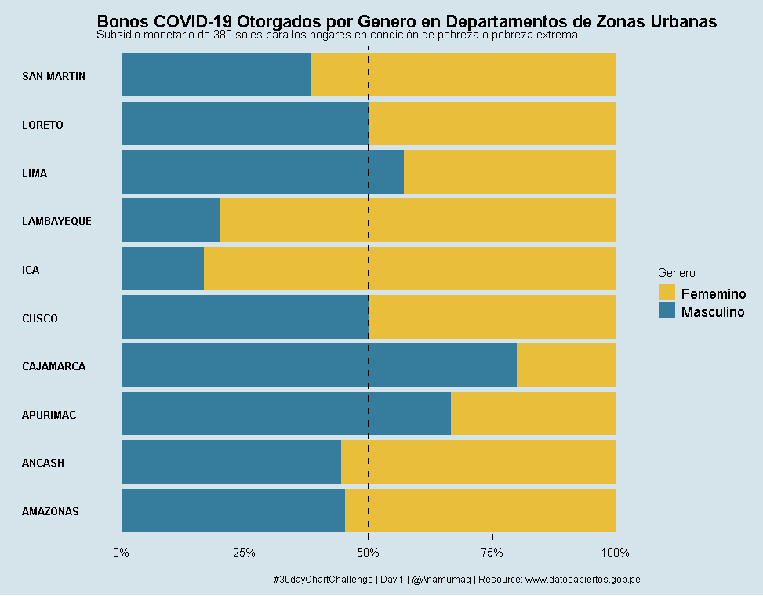
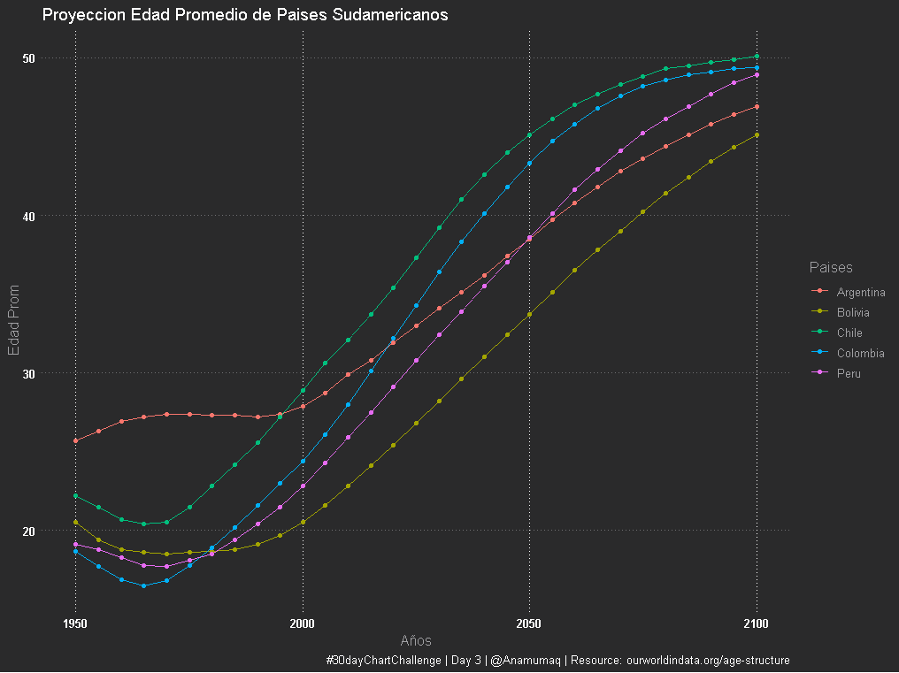

# 30DayChartChallenge
Mi contribucion para el #30DayChartChallenge en Abril 2021

* Source: Data extraida de recursos publicos (en su mayoria PERU)

## El reto

Mas info en este [repo](https://github.com/Z3tt/30DayChartChallenge_Collection2021)

## Comparisons
### 1. part-to-whole

 *Script [aqui](Scripts/Dia 1 - part to whole.R)

### 2. pictogram
*Script [aqui](Scripts/Dia 1 - pictogram.R)

### 3. historical
*Script [aqui](Scripts/Dia 3 - historical.R)

### 4. magical
### 5. slope
### 6. experimental 
## Distributions
### 7. physical
### 8. animals
### 9. statistics
### 10. abstract
### 11. circular
### 12. strips
## Relationships
### 13. correlation
### 14. space
### 15. multivariate
### 16. trees
### 17. pop culture
### 18. connections
## Timeseries
### 19. global change
### 20. upwards
### 21. downwards
### 22. animation
### 23. tiles
### 24. monochrome
## Uncertainties
### 25. demographic
### 26. trends
### 27. educational
### 28. future
### 29. deviations
### 30. 3D
